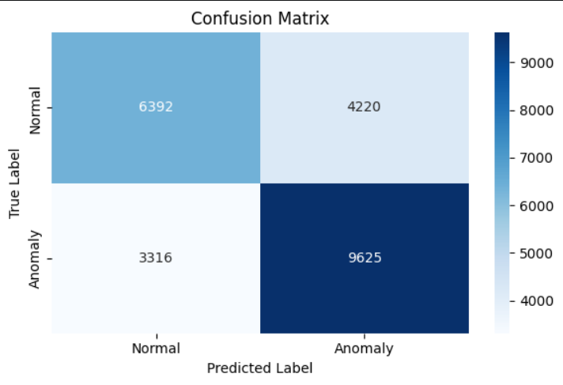
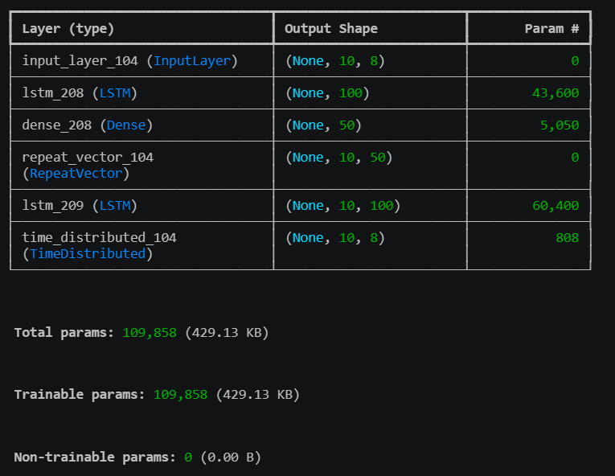
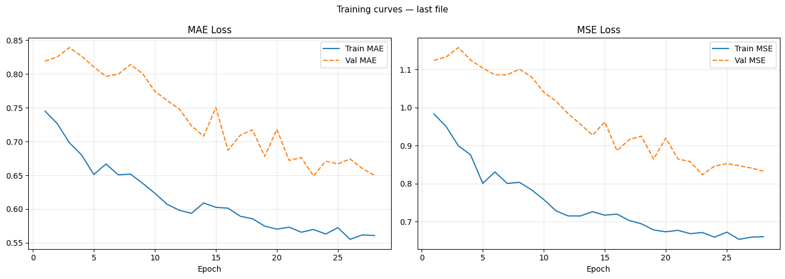

# LSTM Autoencoder for Industrial Anomaly Detection

Anomaly detection on multivariate sensor data from the [SKAB benchmark](https://www.kaggle.com/datasets/yuriykatser/skoltech-anomaly-benchmark-skab); a real industrial water-pump testbed with 8 sensors and labeled anomaly events.

The model is an LSTM autoencoder trained only on normal data. It learns to reconstruct normal sensor patterns. When an anomaly occurs, reconstruction error spikes and that spike is the detection signal.

## Results

| Metric | Score |
|---|---|
| F1 | 0.72 |
| Recall | 0.74 |
| Precision | 0.70 |

Evaluated across all 34 anomaly experiment files (23,553 total test windows).



The model favours recall over precision by design. The detection threshold is set at `quantile(train_errors, 0.97) × 1.5`, which is intentionally aggressive — in an industrial setting, missing a real anomaly is more costly than a false alarm. This results in 4,220 false positives alongside 9,625 true positives.

## Model Architecture

LSTM encoder -> Dense bottleneck -> RepeatVector -> LSTM decoder -> TimeDistributed output

Input shape: `(10 timesteps, 8 sensors)`  
Total parameters: 109,858



One model is trained per experiment file (34 total). This is intentional — each file represents a different operating condition, so a per-file baseline is more precise than a single global model.

## Training



Early stopping with patience=5 and restore_best_weights. The gap between train and validation loss is expected; The model fits the specific normal pattern of each file's training segment.

## Dataset

SKAB (Skoltech Anomaly Benchmark) / 35 CSV files from a physical water-pump testbed with sensors including accelerometers, pressure, temperature, voltage, and flow rate. Downloaded automatically via `kagglehub`.


```bash
pip install kaggle
# Place kaggle.json in ~/.kaggle/ or set KAGGLE_USERNAME and KAGGLE_KEY env vars
```

## How to Run

```bash
git clone https://github.com/Amirfrf/lstm-anomaly-detection
cd lstm-anomaly-detection
pip install -r requirements.txt
jupyter notebook Anomaly_Detection.ipynb
```

Run cells in order. The training cell (Section 4) trains 34 models and will take several minutes depending on hardware. Trained models are saved to `models/` locally and are excluded from the repository.

To test a single file after training, change `DEMO_FILE_ID` in the last cell (0–33) and run it.

## Environment

Python 3.12.10 · TensorFlow 2.21.0 · Tested on local CPU

## Citation

SKAB dataset:
Katser, I. D., & Kozitsin, V. O. (2020). Skoltech Anomaly Benchmark (SKAB). Kaggle. https://doi.org/10.34740/KAGGLE/DSV/1693952
