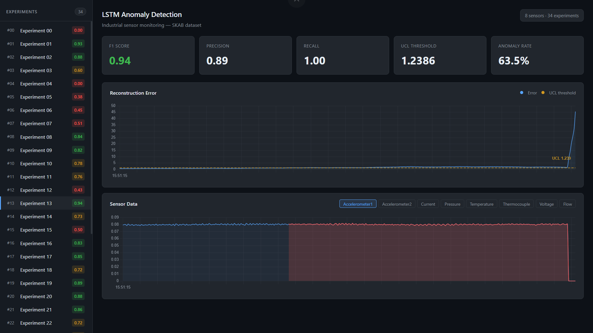

# LSTM Autoencoder for Industrial Anomaly Detection

Anomaly detection on multivariate sensor data from the [SKAB benchmark](https://www.kaggle.com/datasets/yuriykatser/skoltech-anomaly-benchmark-skab), a real industrial water-pump testbed with 8 sensors and labeled anomaly events.

The model is an LSTM autoencoder trained only on normal data. It learns to reconstruct normal sensor patterns. When an anomaly occurs, reconstruction error spikes and that spike is the detection signal. Results are served through a FastAPI backend and visualized in a React dashboard.

## Results

| Metric | Score |
| --- | --- |
| F1 | 0.72 |
| Recall | 0.74 |
| Precision | 0.70 |

Evaluated across all 34 anomaly experiment files (23,553 total test windows).


The model favours recall over precision by design. The detection threshold is set at `quantile(train_errors, 0.97) × 1.5`, which is intentionally aggressive. In an industrial setting, missing a real anomaly is more costly than a false alarm.

## Model Architecture

LSTM encoder → Dense bottleneck → RepeatVector → LSTM decoder → TimeDistributed output

Input shape: `(10 timesteps, 8 sensors)`
Total parameters: 109,858


One model is trained per experiment file (34 total). Each file represents a different operating condition, so a per-file baseline is more precise than a single global model.

## Training


Early stopping with patience=5 and restore_best_weights. The gap between train and validation loss is expected; the model fits the specific normal pattern of each file's training segment.

## Web Dashboard

A full-stack monitoring dashboard built on top of the trained models.

**Stack:** FastAPI (Python) · React · Vite · Chart.js

**Features:**
- Sidebar listing all 34 experiments, colour-coded by F1 score
- Reconstruction error chart with the UCL threshold line
- Per-sensor data chart with anomaly regions highlighted in red
- Live metric cards: F1, Precision, Recall, Threshold, Anomaly Rate



## Dataset

SKAB (Skoltech Anomaly Benchmark) - 35 CSV files from a physical water-pump testbed with sensors including accelerometers, pressure, temperature, voltage, and flow rate. Downloaded automatically via `kagglehub`.

If Kaggle authentication is required in your environment, configure it the way `kagglehub` expects for your setup.

## How to Run

**1. Train the models**

```bash
git clone https://github.com/Amirfrf/lstm-anomaly-detection
cd lstm-anomaly-detection
pip install -r requirements.txt
jupyter notebook Anomaly_Detection.ipynb
```

Run cells in order. Training 34 models will take several minutes depending on hardware. Trained models are saved to `models/` locally.

**2. Generate dashboard data**

```bash
python generate_data.py
```

This reads the saved models and writes pre-computed results to `data/`. Run once after training.

**3. Start the backend**

```bash
python -m uvicorn main:app --reload
```

**4. Start the frontend**

```bash
cd frontend
npm install
npm run dev
```

Open `http://localhost:5173` in your browser.

## Project Structure